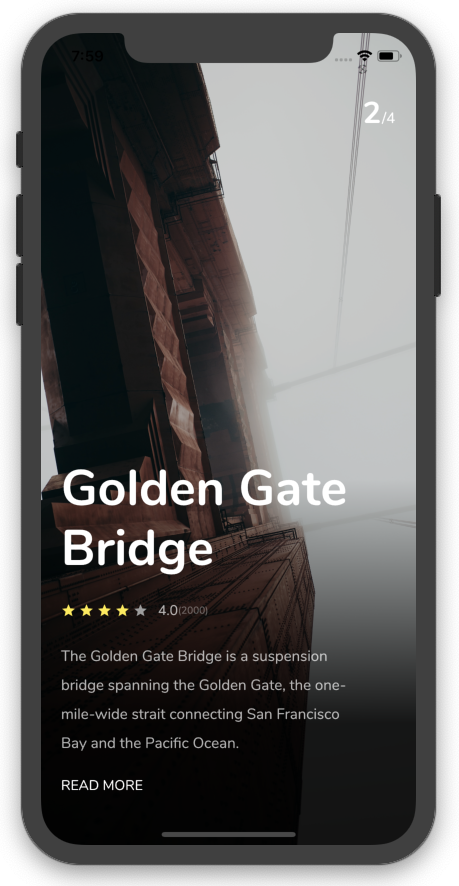
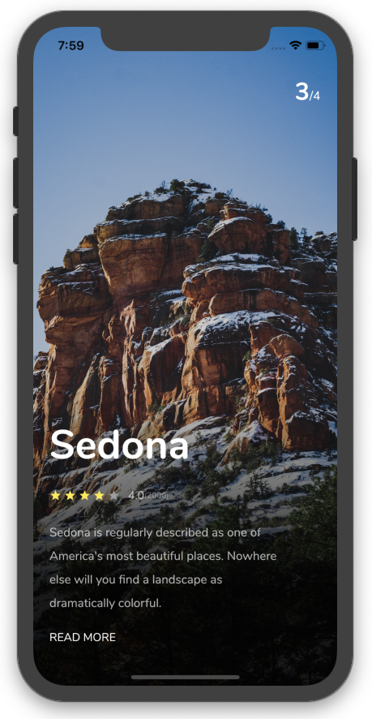

# Flutter Trip App

This Flutter Trip App UI is a project developed as part of the 100 Days of Flutter Challenge. It is a mobile application UI design that showcases a visually appealing and user-friendly interface for a trip planning app. The UI includes various screens and components commonly found in travel applications.

## ScreenShots




## Development Setup
Clone the repository and run the following commands:
```
flutter pub get
flutter run
```
